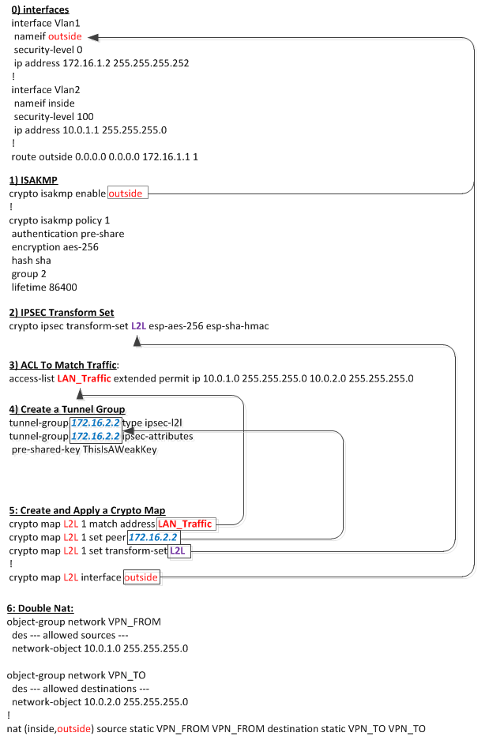

# ASA to ASA VPN

## Overview

The following chart goes through the basics of what is needed and how it is interlinked. Below that is details for each section and to use them.



Below this is the discussion as far as what is happening, and why it's necessary.

## 0-Interface

For the interface, you only need to know two things about your external interface:

```bash
nameif outside
```

You will need to know the name of the exterior interface; in this case "outside". This will be required for both in section-1, to define what interface to listen for isakmp traffic, and for section-5, for binding a crypto map to talk out the interface.

```bash
ip address 172.16.1.2 255.255.255.0
```

You will also need to know the IP address of the interface, because the remote side's configs will need it for both section-4, when naming a tunnel-group, and in section-5 when defining the crypto map's remote peer's ip.

## 1-ISAKMP

You will need to tell the firewall to listen for isakmp traffic on the external (in this case "outside") interface.

```bash
crypto isakmp enable outside
```

You will also need to define a crypto isakmp policy that matches on both ends of the tunnel.

```bash
crypto isakmp policy 1
authentication pre-share
encryption aes-256
hash sha
group 2
lifetime 86400
```

Note that you might have a couple of different policies with different numbers (this one is numbered "1"). You do not need to have multiple policies if they match, they just help line up encryption methods, CA timeouts, hash methods, etc. If you already have a definition in your firewall that matches your desired one, but uses a different number, feel free to use that. (the number just is used by the firewall for presidence for which method to try when new isakmp traffic is received.

## 2-IPSec Transform Set

The transform-set says what kind of encryption methods will be used for a specific tunnel.

```bash
crypto ipsec transform-set L2L esp-ase-256 esp-sha-hmac
```

You will bind the transform-set via its name (L2L) with a specific crypto map in section-5. You can have multiple crypto maps using the same transform-set.

## 3-ACL To Match Traffic

The ACL will define what traffic should be sent though this tunnel.

In this case, we are allowing traffic from the local .1/24 network to connect to the remote .2/24 network.

```bash
access-list LAN_Traffic extended permit ip 10.0.1.0 255.255.255.0 10.0.2.0 255.255.255.0
```

This will be bound t a crypto map in section-5.

Since this ACL is to route or not route traffic over a tunnel, if you want ACL-ing for security, then you should add ACL's on inside interfaces that specifically limit traffic from one point to another.

## 4-Create A Tunnel Group

The tunnel group simply defines what the remote site will be, and what the shared key will be.

```bash
tunnel-group 172.16.2.2 type ipsec-l2l
tunnel-group 172.16.2.2 ipsec-attributes
pre-shared-key ThisIsAWeakKey
```

The IP address (172.16.2.2) is the name of the tunnel group, but it is also needs to be the remote site's IP address.

    "For LAN-to-LAN connections, the adaptive security appliance attempts to select a tunnel group for a connection by matching the peer address specified in the crypto map to a tunnel group of the same name. Therefore, for IPv6 peers, you should configure the tunnel group name as the IPv6 address of the peer. You can specify the tunnel group name in short or long notation. The CLI reduces the name to the shortest notation." - tunnel-group Command Lookup: v8.3"

You also need to make sure that both sides of the tunnel share the same pre-shared-key. See random for good keys to use.

## 5-Create and Apply a Crypto Map

You can have only ONE crypto map assigned to an interface (see line 05), so if you already have Dynamic or other crypto maps, make sure that the name "L2L" is the one in use. Otherwise, when you enable this, it will shut down the other vpn's that you currently have!!!

Because of the fact that only one crypto map can be assigned to an interface, you need to keep your different cryptomaps separate with their sequence number (in this example "1"). When traffic is accepted on the interface, it tries to find a matching crypto map to use to decode it. It will hunt through all the maps in order (1 through n).

```bash
01 crypto map L2L 1 match address LAN_Traffic
02 crypto map L2L 1 set peer 172.16.2.2
03 crypto map L2L 1 set transform-set L2L
04 !
05 crypto map L2L interface outside
```

The crypto map name (in line 03) is a different variable then the transform-set name, even though in this example, they are both "L2L".  Sorry, I should have probably used different names to make things a bit more clear in the example.

When you are pasting the configs for the crypto map, the asa wonderfully gives you the following error until you paste all three lines.  It means to say that the line ~is~ complete, just not the SET of lines.  

```bash
asa (config)# crypto map L2L 1 match address LAN_Traffic
WARNING: The crypto map entry is incomplete!
```

When your done, you can do a sh run crypto map to make sure all your configs were pasted in properly.  Also don't forget to make sure that the crypto map is bound to an interface, and make sure that you don't UNBIND a current crypto map while doing this.  (only one crypto map per interface)

## 6-Double NAT

The double nat statement basically tells the firewall to NOT NAT traffic between the source and destination.  

```bash
nat (inside,outside) source static VPN_FROM VPN_FROM destination static VPN_TO VPN_TO
```

The double statements "VPN_FROM VPN_FROM" are required because you can induce fancy natting if required, but to disable natting, just duplicate the source and destination sections, and make sure they are both defined as static.
