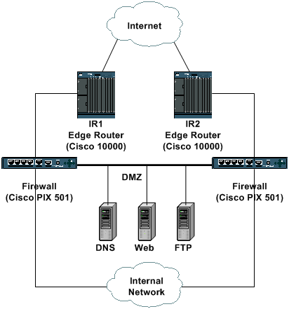

# Listes de contrôle d'accès de transit : Filtrage de la périphérie

## Introduction

Ce document présente des instructions et recommande des techniques de déploiement pour filtrer le transit et le trafic périphérique au niveau des points d'entrée de votre réseau. Des Listes de contrôle d'accès (ACL) du transit sont utilisées pour augmenter la sécurité des réseaux, ne permettant qu'au trafic requis de pénétrer dans votre ou vos réseau(x.)

## Filtres de transit

### Configuration type

Dans la plupart des environnements de réseau de périphérie, tels qu'un point de présence Internet d'entreprise classique, le filtrage d'entrée doit être utilisé pour supprimer le trafic non autorisé à la périphérie du réseau. Dans certains déploiements de fournisseurs de services, cette forme de filtrage du trafic de périphérie ou de transit peut également être utilisée efficacement pour limiter le flux du trafic de transit à destination et en provenance des clients vers des protocoles autorisés spécifiques uniquement. Ce document se concentre sur un modèle de déploiement d'entreprise.

Cet exemple illustre une conception type de connectivité Internet d'entreprise. Deux routeurs de périphérie, IR1 et IR2, fournissent une connectivité directe à Internet. Derrière ces deux routeurs, une paire de pare-feu (Cisco PIXes dans cet exemple) fournit des fonctionnalités d'inspection dynamique et un accès au réseau interne et à la zone démilitarisée (DMZ). La zone démilitarisée (DMZ) contient des services publics tels que DNS et Web ; il s'agit du seul réseau accessible directement depuis l'Internet public. Le réseau interne ne doit jamais être accessible directement par Internet, mais le trafic provenant du réseau interne doit pouvoir atteindre les sites Internet.



Les routeurs de périphérie doivent être configurés pour fournir un premier niveau de sécurité via l’utilisation de listes de contrôle d’accès entrantes. Les listes de contrôle d’accès autorisent uniquement le trafic spécifiquement autorisé vers la DMZ et autorisent le trafic de retour pour les utilisateurs internes accédant à Internet. Tout le trafic non autorisé doit être abandonné sur les interfaces d'entrée.

### Sections ACL de transit

En général, une liste de contrôle d’accès de transit se compose de quatre sections.

- Entrées d'adresse à usage spécial et d'anti-usurpation qui empêchent les sources et les paquets illégitimes dont les adresses sources appartiennent à votre réseau d'entrer sur le réseau à partir d'une source externe

  **\*Remarque :** [RFC 1918](http://www.ietf.org/rfc/rfc1918.txt?number=1918) définit l'espace d'adressage réservé qui n'est pas une adresse source valide sur Internet. La [RFC 3330](http://www.ietf.org/rfc/rfc3330.txt?number=3330) leavingcisco.com définit les adresses à usage spécial qui peuvent nécessiter un filtrage. [La RFC 2827](http://www.ietf.org/rfc/rfc2827.txt?number=2827) leavingcisco.com fournit des directives anti-usurpation.

- Autorisation explicite du trafic de retour pour les connexions internes à Internet

- Trafic externe explicitement autorisé destiné aux adresses internes protégées

- Instruction deny explicite

  **_Remarque :_** Bien que toutes les listes de contrôle d'accès contiennent une instruction deny implicite, Cisco recommande l'utilisation d'une instruction deny explicite, par exemple deny ip any any any. Sur la plupart des plates-formes, de telles instructions maintiennent le nombre de paquets refusés qui peuvent être affichés à l'aide de la commande show access-list.

## Comment développer une liste de contrôle d'accès de transit

La première étape du développement d’une liste de contrôle d’accès de transit consiste à déterminer les protocoles requis au sein de vos réseaux. Bien que chaque site ait des exigences spécifiques, certains protocoles et applications sont largement utilisés et le plus souvent autorisés. Par exemple, si le segment DMZ fournit la connectivité à un serveur Web accessible au public, le protocole TCP d'Internet vers les adresses de serveur DMZ sur le port 80 est requis. De même, les connexions internes à Internet exigent que la liste de contrôle d’accès autorise le retour du trafic TCP établi - trafic dont le bit ACK (accusé de réception) est défini.

### Identification des protocoles requis

Le développement de cette liste de protocoles requis peut être une tâche ardue, mais plusieurs techniques peuvent être utilisées, si nécessaire, pour aider à identifier le trafic requis.

- **_Examinez votre stratégie de sécurité locale/votre stratégie de service._**

  Votre politique de site local doit vous aider à fournir une base de référence pour les services autorisés et refusés.

- **_Examinez/auditez la configuration de votre pare-feu._**

  La configuration actuelle du pare-feu doit contenir des instructions **_d'autorisation_** explicites pour les services autorisés. Dans de nombreux cas, vous pouvez traduire cette configuration au format ACL et l'utiliser pour créer le gros des entrées ACL.

  **_Remarque :_** Les pare-feu avec état n'ont généralement pas de règles explicites pour le trafic de retour vers les connexions autorisées. Puisque les listes de contrôle d’accès des routeurs ne sont pas dynamiques, le trafic de retour doit être explicitement autorisé.

- **_Examiner/auditer vos applications._**

  Les applications hébergées sur la DMZ et celles utilisées en interne peuvent aider à déterminer les exigences de filtrage. Examiner les exigences de l'application afin de fournir des détails essentiels sur la conception du filtrage.

- **_Utilisez une liste de contrôle d’accès de classification._**

  Une liste de contrôle d’accès de classification est composée d’instructions **_permit_** pour les différents protocoles qui pourraient être destinés au réseau interne. (Voir [l'annexe A](d) pour une liste des protocoles et applications couramment utilisés.) Utilisez la commande `show access-list` pour afficher un nombre de résultats d'entrée de contrôle d'accès (ACE) afin d'identifier les protocoles requis. Examinez et comprenez tous les résultats suspects ou surprenants avant de créer des instructions **_d'autorisation_** explicites pour les protocoles inattendus.

- **_Utilisez la fonction de commutation Netflow._**
  Netflow est une fonction de commutation qui, si elle est activée, fournit des informations détaillées sur le flux. Si Netflow est activé sur vos routeurs de périphérie, la commande `show ip cache` flow donne une liste des protocoles consignés par Netflow. Netflow ne pouvant pas identifier tous les protocoles, cette technique doit donc être utilisée conjointement avec d’autres.

### Identifier le trafic non valide

Outre la protection directe, la liste de contrôle d’accès de transit doit également fournir une première ligne de défense contre certains types de trafic non valide sur Internet.

- Refuser l'espace RFC 1918.
- Refuser les paquets avec une adresse source qui tombe sous un espace d'adressage à usage spécial, tel que défini dans la RFC 3330.
- Appliquer des filtres antispoof conformément à la RFC 2827 ; votre espace d'adressage ne doit jamais être la source de paquets provenant de l'extérieur de votre système autonome (AS).

Les autres types de trafic à prendre en compte sont les suivants :

- **_Protocoles externes et adresses IP qui doivent communiquer avec le routeur de périphérie_**

  - ICMP à partir des adresses IP du fournisseur de services
  - Protocoles de routage
  - VPN IPSec, si un routeur de périphérie est utilisé comme terminaison

- **_Autorisation explicite du trafic de retour pour les connexions internes à Internet_**

  - Types de protocole ICMP (Internet Control Message Protocol) spécifiques
  - Réponses de requête DNS (Domain Name System) sortantes
  - TCP établi
  - Trafic de retour UDP (User Datagram Protocol)
  - Connexions de données FTP
  - Connexions de données TFTP
  - Connexions multimédias

- **_Trafic externe explicitement autorisé destiné aux adresses internes protégées_**

  - Trafic VPN

    - ISAKMP (Internet Security Association and Key Management Protocol)
    - Traversée NAT (Network Address Translation)
    - Encapsulation propriétaire
    - Encapsulating Security Payload (ESP)
    - En-tête d'authentification (AH)

  - HTTP vers les serveurs Web
  - SSL (Secure Socket Layer) vers les serveurs Web
  - Serveurs FTP
  - Connexions de données FTP entrantes
  - Connexions de données FTP passives entrantes (pasv)
  - SMTP (Simple Mail Transfer Protocol)
  - Autres applications et serveurs
  - Requêtes DNS entrantes
  - Transferts de zone DNS entrants

### Appliquez l'ACL

La nouvelle liste de contrôle d’accès doit être appliquée en entrée sur les interfaces Internet des routeurs de périphérie. Dans l'exemple illustré dans la section [Configuration type](https://), la liste de contrôle d'accès est appliquée sur les interfaces orientées Internet sur IR1 et IR2.

Reportez-vous aux sections sur [les directives de déploiement](sd) et [l'exemple de déploiement](sd) pour plus de détails.

## Exemple de liste de contrôle d'accès

Cette liste d’accès fournit un exemple simple mais réaliste des entrées typiques requises dans une liste de contrôle d’accès de transit. Cette liste de contrôle d’accès de base doit être personnalisée avec les détails de configuration spécifiques au site local.

```bash
!--- Add anti-spoofing entries.
!--- Deny special-use address sources.
!--- Refer to RFC 3330 for additional special use addresses.

access-list 110 deny ip 127.0.0.0 0.255.255.255 any
access-list 110 deny ip 192.0.2.0 0.0.0.255 any
access-list 110 deny ip 224.0.0.0 31.255.255.255 any
access-list 110 deny ip host 255.255.255.255 any
```

```bash
!--- The deny statement should not be configured
!--- on Dynamic Host Configuration Protocol (DHCP) relays.

access-list 110 deny ip host 0.0.0.0 any
```

```bash
!--- Filter RFC 1918 space.

access-list 110 deny ip 10.0.0.0 0.255.255.255 any
access-list 110 deny ip 172.16.0.0 0.15.255.255 any
access-list 110 deny ip 192.168.0.0 0.0.255.255 any
```

```bash
!--- Permit Border Gateway Protocol (BGP) to the edge router.

access-list 110 permit tcp host bgp_peer gt 1023 host router_ip eq bgp
access-list 110 permit tcp host bgp_peer eq bgp host router_ip gt 1023
```

```bash
!--- Deny your space as source (as noted in RFC 2827).

access-list 110 deny ip your Internet-routable subnet any
```

```bash
!--- Explicitly permit return traffic.
!--- Allow specific ICMP types.

access-list 110 permit icmp any any echo-reply
access-list 110 permit icmp any any unreachable
access-list 110 permit icmp any any time-exceeded
access-list 110 deny   icmp any any
```

```bash
!--- These are outgoing DNS queries.

access-list 110 permit udp any eq 53  host primary DNS server gt 1023
```

```bash
!--- Permit older DNS queries and replies to primary DNS server.

access-list 110 permit udp any eq 53  host primary DNS server eq 53
```

```bash
!--- Permit legitimate business traffic.

access-list 110 permit tcp any Internet-routable subnet established
access-list 110 permit udp any range 1 1023 Internet-routable subnet gt 1023
```

```bash
!--- Allow ftp data connections.

access-list 110 permit tcp any eq 20 Internet-routable subnet gt 1023
```

```bash
!--- Allow tftp data and multimedia connections.

access-list 110 permit udp any gt 1023 Internet-routable subnet gt 1023
```

```bash
!--- Explicitly permit externally sourced traffic. !--- These are incoming DNS queries.

access-list 110 permit udp any gt 1023 host <primary DNS server> eq 53
```

```bash
!-- These are zone transfer DNS queries to primary DNS server.

access-list 110 permit tcp host secondary DNS server gt 1023 host primary DNS server eq 53
```

```bash
!--- Permit older DNS zone transfers.

access-list 110 permit tcp host secondary DNS server eq 53  host primary DNS server eq 53
```

```bash
!--- Deny all other DNS traffic.

access-list 110 deny udp any any eq 53
access-list 110 deny tcp any any eq 53
```

```bash

!--- Allow IPSec VPN traffic.

access-list 110 permit udp any host IPSec headend device eq 500
access-list 110 permit udp any host IPSec headend device eq 4500
access-list 110 permit 50 any host IPSec headend device
access-list 110 permit 51 any host IPSec headend device
access-list 110 deny   ip any host IPSec headend device
```

```bash
!--- These are Internet-sourced connections to
!--- publicly accessible servers.

access-list 110 permit tcp any host public web server eq 80
access-list 110 permit tcp any host public web server eq 443
access-list 110 permit tcp any host public FTP server eq 21
```

```bash
!--- Data connections to the FTP server are allowed
!--- by the permit established ACE.
!--- Allow PASV data connections to the FTP server.

access-list 110 permit tcp any gt 1023 host public FTP server gt 1023
access-list 110 permit tcp any host public SMTP server eq 25
```

```bash
!--- Explicitly deny all other traffic.

access-list 101 deny ip any any
```

**_remarque_**: gardez ces suggestions à l'esprit lorsque vous appliquez la liste de contrôle d'accès de transit.

- Le mot clé `log` peut être utilisé afin de fournir des détails supplémentaires sur la source et les destinations pour un protocole donné. Bien que ce mot clé fournisse des informations précieuses sur les détails des accès ACL, les accès excessifs à une entrée ACL qui utilise le mot clé `log` augmentent l'utilisation du CPU. L'impact sur les performances lié à la journalisation varie en fonction de la plate-forme.

- Les messages ICMP inaccessibles sont générés pour les paquets qui sont refusés administrativement par une liste de contrôle d’accès. Cela peut avoir un impact sur les performances des routeurs et des liaisons. Considérez l'utilisation de la commande `no ip unreachables` afin de désactiver IP unreachables sur l'interface sur laquelle la liste de contrôle d'accès de transit (edge) est déployée.

- Cette liste de contrôle d’accès peut être initialement déployée avec toutes les instructions **_permit_** afin de s’assurer que le trafic légitime de l’entreprise n’est pas refusé. Une fois le trafic légitime de l'entreprise identifié et pris en compte, les éléments de refus spécifiques peuvent être configurés.

## ACL et paquets fragmentés

Les ACL ont un mot clé de **_fragments qui active le comportement de gestion des paquets fragmentés spécialisés_**. En général, les fragments non initiaux qui correspondent aux instructions de couche 3 (protocole, adresse source et adresse de destination), indépendamment des informations de couche 4 d'une liste de contrôle d'accès, sont affectés par l'instruction `permit` ou `deny` de l'entrée correspondante. Notez que l'utilisation du mot clé `fragments` peut forcer les ACL à refuser ou autoriser les fragments non initiaux avec plus de granularité.

Le filtrage des fragments ajoute une couche supplémentaire de protection contre une attaque par déni de service (DoS) qui utilise uniquement des fragments non initiaux (tels que FO > 0). L’utilisation d’une instruction `deny` pour les fragments non initiaux au début de la liste de contrôle d’accès empêche tous les fragments non initiaux d’accéder au routeur. Dans de rares circonstances, une session valide peut nécessiter une fragmentation et donc être filtrée si une instruction `deny fragment` existe dans la liste de contrôle d’accès. Parmi les conditions susceptibles d'entraîner une fragmentation, citons l'utilisation de certificats numériques pour l'authentification ISAKMP et l'utilisation de la traversée NAT IPSec.

Par exemple, prenez en compte la liste de contrôle d’accès partielle illustrée ici.

```bash
access-list 110 deny tcp any Internet routable subnet fragments
access-list 110 deny udp any Internet routable subnet fragments
access-list 110 deny icmp any Internet routable subnet fragments
<rest of ACL>
```

L’ajout de ces entrées au début d’une liste de contrôle d’accès refuse tout accès de fragment non initial au réseau, tandis que les paquets non fragmentés ou les fragments initiaux passent aux lignes suivantes de la liste de contrôle d’accès sans être affectés par les **_instructions de fragment de refus_**. L’extrait de liste de contrôle d’accès précédent facilite également la classification de l’attaque puisque chaque protocole (UDP, TCP et ICMP) incrémente des compteurs distincts dans la liste de contrôle d’accès.

Comme de nombreuses attaques reposent sur l’inondation de paquets fragmentés, le filtrage des fragments entrants vers le réseau interne fournit une mesure de protection supplémentaire et permet de s’assurer qu’une attaque ne peut pas injecter des fragments en faisant simplement correspondre les règles de couche 3 dans la liste de contrôle d’accès de transit.

Consultez les [listes de contrôle d'accès et les fragments d'IP pour une analyse détaillée des options.](https://www.cisco.com/c/en/us/support/docs/ip/generic-routing-encapsulation-gre/8014-acl-wp.html).

## Évaluation des risques

Lorsque vous déployez des listes de contrôle d'accès de protection du trafic de transit, tenez compte de deux domaines de risque clés.

- Assurez-vous que les instructions appropriées de **_permis/refus sont en place._** Pour que la liste de contrôle d’accès soit efficace, vous devez autoriser tous les protocoles requis.

- Les performances de l'ACL varient entre une plate-forme et l'autre. Avant de déployer des listes de contrôle d'accès, examinez les caractéristiques de performances de votre matériel.

Cisco vous recommande de tester cette conception dans les travaux pratiques avant le déploiement.

## Annexes

### **Protocoles et applications couramment utilisés**

#### **Noms des ports TCP**

Cette liste de noms de ports TCP peut être utilisée à la place des numéros de port lorsque vous configurez la liste de contrôle d'accès dans le logiciel Cisco IOS®. Reportez-vous à la RFC du numéro attribué actuel afin de trouver une référence à ces protocoles. Les numéros de port qui correspondent à ces protocoles sont également disponibles lors de la configuration de la liste de contrôle d’accès en entrant un ? à la place d'un numéro de port.

| <!-- -->      | <!-- -->        |
| ------------- | --------------- |
|bgp  | kshell
|chargen | login|
|cmd  | lpd|
|daytime | nntp|
|discard | pim|
|domain | pop2|
|echo | pop3|
|exec | smtp|
|finger | sunrpc|
|ftp  | syslog|
|ftp-data | tacacstalk|
|gopher | telnet|
|hostname |  time|
|ident | uucp|
|irc  | whois|
|klogin | www|

#### **Noms des ports UDP**

Cette liste de noms de ports UDP peut être utilisée à la place des numéros de port lorsque vous configurez la liste de contrôle d'accès dans le logiciel Cisco IOS. Reportez-vous à la RFC du numéro attribué actuel afin de trouver une référence à ces protocoles. Les numéros de port qui correspondent à ces protocoles sont également disponibles lors de la configuration de la liste de contrôle d’accès en entrant un ? à la place d'un numéro de port.
| <!-- --> | <!-- --> |
| ------------- | --------------- |
|biff | ntp|
|bootpc | pim-auto-rp|
|bootps | rip|
|discard | snmp|
|dnsix | snmptrap|
|domain | sunrpc|
|echo | syslog|
|isakmp | tacacs|
|mobile-ip | talk|
|nameserver | tftp|
|netbios-dgm | time|
|netbios-ns | who|
|netbios-ss |  xdmcp|

### **Directives de déploiement**

Cisco recommande des pratiques de déploiement conservatrices. Vous devez avoir une bonne compréhension des protocoles requis pour déployer correctement les listes de contrôle d’accès de transit. Ces directives décrivent une méthode très prudente pour le déploiement des listes de contrôle d'accès de protection qui utilisent une approche itérative.

1. **Identifiez les protocoles de routage utilisés dans le réseau avec une ACL de classification.**
    Déployez une liste de contrôle d’accès qui autorise tous les protocoles connus utilisés dans le réseau. Cette détection, ou classification, doit avoir une adresse source de **n’importe quelle** et une destination d’une adresse IP ou de l’ensemble du sous-réseau IP routable sur Internet. Configurez une dernière entrée qui autorise **ip any** log afin d'identifier les protocoles supplémentaires que vous devez autoriser.

    L’objectif est de déterminer tous les protocoles requis utilisés sur le réseau. Utilisez la journalisation pour l'analyse afin de déterminer ce qui pourrait communiquer avec le routeur.

    **Remarque** : bien que le mot clé `log` fournisse des informations précieuses sur les détails des accès ACL, les accès excessifs à une entrée ACL qui utilise ce mot clé peuvent entraîner un nombre écrasant d'entrées de journal et éventuellement une utilisation élevée du CPU du routeur. Utilisez le mot clé `log` pour de courtes périodes et uniquement lorsque nécessaire afin d'aider à classer le trafic.

    Veuillez noter que le réseau risque d'être attaqué alors qu'une liste de contrôle d'accès composée de toutes les instructions **d'autorisation** est en place. Effectuez le processus de classification le plus rapidement possible afin de mettre en place des contrôles d'accès appropriés.

2. **Examiner les paquets identifiés et commencer à filtrer l’accès au réseau interne.**
    Une fois que vous avez identifié et examiné les paquets filtrés par la liste de contrôle d’accès à l’étape 1, mettez à jour la liste de contrôle d’accès de classification pour tenir compte des protocoles et des adresses IP nouvellement identifiés. Ajoutez des entrées de liste de contrôle d’accès pour l’anti-usurpation. Au besoin, remplacez les entrées **de refus** spécifiques par des instructions `permit` dans la liste de contrôle d’accès de classification. Vous pouvez utiliser la commande `show access-list` pour surveiller des entrées **de refus** spécifiques pour contrôler le nombre de résultats. Cela fournit des informations sur les tentatives d'accès réseau interdites sans avoir à activer la journalisation sur les entrées ACL. La dernière ligne de la liste de contrôle d’accès doit être une **instruction** `deny ip any any`. Une fois de plus, le nombre de tentatives d'accès interdites par rapport à cette dernière entrée peut fournir des informations.

3. **Surveillez et mettez à jour la liste de contrôle d’accès.**
    Surveillez la liste de contrôle d’accès terminée afin de vous assurer que les protocoles requis récemment introduits sont ajoutés de manière contrôlée. Si vous surveillez la liste de contrôle d’accès, elle fournit également des informations sur les tentatives d’accès réseau interdites qui peuvent fournir des informations sur les attaques imminentes.

### **Exemple de déploiement**

Cet exemple montre une liste de contrôle d'accès de transit qui protège un réseau en fonction de cet adressage.

- L’adresse IP du routeur ISP est `10.1.1.1`.
L’adresse IP du routeur de périphérie orientée vers Internet est `10.1.1.2`.
- Le sous-réseau routable par Internet est `192.168.201.0 255.255.255.0.`
- La tête de réseau VPN est `192.168.201.100`.
- Le serveur Web est `192.168.201.101`.
- Le serveur FTP est `192.168.201.102`.
- Le serveur SMTP est `192.168.201.103`.
- Le serveur DNS principal est `192.168.201.104`.
- Le serveur DNS secondaire est `172.16.201.50`.

La liste de contrôle d’accès de la protection du transit a été développée à partir de ces informations. La liste de contrôle d'accès autorise l'appairage eBGP vers le routeur ISP, fournit des filtres anti-spoof, autorise un trafic de retour spécifique, autorise un trafic entrant spécifique et refuse explicitement tout autre trafic.

```bash
no access-list 110

!--- Phase 1 – Add anti-spoofing entries. 
!--- Deny special-use address sources. 
!--- See RFC 3330 for additional special-use addresses.

access-list 110 deny   ip 127.0.0.0 0.255.255.255 any
access-list 110 deny   ip 192.0.2.0 0.0.0.255 any
access-list 110 deny   ip 224.0.0.0 31.255.255.255 any
access-list 110 deny   ip host 255.255.255.255 any

!--- This deny statement should not be configured 
!--- on Dynamic Host Configuration Protocol (DHCP) relays.

access-list 110 deny   ip host 0.0.0.0 any

!--- Filter RFC 1918 space.

access-list 110 deny   ip 10.0.0.0 0.255.255.255 any
access-list 110 deny   ip 172.16.0.0 0.15.255.255 any
access-list 110 deny   ip 192.168.0.0 0.0.255.255 any

!--- Permit BGP to the edge router.

access-list 110 permit tcp host 10.1.1.1 gt 1023 host 10.1.1.2 eq bgp
access-list 110 permit tcp host 10.1.1.1 eq bgp host 10.1.1.2 gt 1023

!--- Deny your space as source (as noted in RFC 2827).

access-list 110 deny   ip 192.168.201.0 0.0.0.255 any


!--- Phase 2 – Explicitly permit return traffic. 
!--- Allow specific ICMP types.

access-list 110 permit icmp any any echo-reply
access-list 110 permit icmp any any unreachable
access-list 110 permit icmp any any time-exceeded
access-list 110 deny   icmp any any

!--- These are outgoing DNS queries.

access-list 110 permit udp any eq domain host 192.168.201.104 gt 1023

!--- Permit older DNS queries and replies to primary DNS server.

access-list 110 permit udp any eq domain host 192.168.201.104 eq domain

!--- Permit legitimate business traffic.

access-list 110 permit tcp any 192.168.201.0 0.0.0.255 established
access-list 110 permit udp any range 1 1023 192.168.201.0 0.0.0.255 gt 1023

!--- Allow FTP data connections.

access-list 110 permit tcp any eq ftp-data 192.168.201.0 0.0.0.255 gt 1023

!--- Allow TFTP data and multimedia connections.

access-list 110 permit udp any gt 1023 192.168.201.0 0.0.0.255 gt 1023


!--- Phase 3 – Explicitly permit externally sourced traffic. 
!--- These are incoming DNS queries.

access-list 110 permit udp any gt 1023 host 192.168.201.104 eq domain

!--- Zone transfer DNS queries to primary DNS server.

access-list 110 permit tcp host 172.16.201.50 gt 1023 host 192.168.201.104 eq domain

!--- Permit older DNS zone transfers.

access-list 110 permit tcp host 172.16.201.50 eq domain host 192.168.201.104 eq domain

!--- Deny all other DNS traffic.

access-list 110 deny   udp any any eq domain
access-list 110 deny   tcp any any eq domain

!--- Allow IPSec VPN traffic.

access-list 110 permit udp any host 192.168.201.100 eq isakmp
access-list 110 permit udp any host 192.168.201.100 eq non500-isakmp
access-list 110 permit esp any host 192.168.201.100
access-list 110 permit ahp any host 192.168.201.100
access-list 110 deny   ip any host 192.168.201.100

!--- These are Internet-sourced connections to 
!--- publicly accessible servers.

access-list 110 permit tcp any host 192.168.201.101 eq www
access-list 110 permit tcp any host 192.168.201.101 eq 443
access-list 110 permit tcp any host 192.168.201.102 eq ftp

!--- Data connections to the FTP server are allowed 
!--- by the permit established ACE in Phase 3. 
!--- Allow PASV data connections to the FTP server.

access-list 110 permit tcp any gt 1023 host 192.168.201.102 gt 1023
access-list 110 permit tcp any host 192.168.201.103 eq smtp


!--- Phase 4 – Add explicit deny statement. 

access-list 110 deny   ip any any

Edge-router(config)#interface serial 2/0
Edge-router(config-if)#ip access-group 110 in
```
