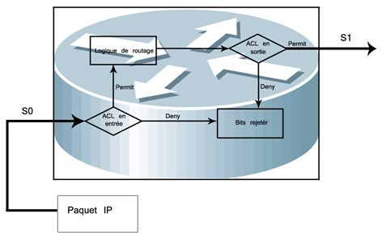

# Les listes d'accès

## Définition

Les listes d'accès (access list) sont des instructions qui expriment une liste de règle, imposées par l'opérateur, donnant un contrôle supplémentaire sur les paquets reçue et transmis par le routeur mais ne concernant pas ceux générés par le routeur. Les listes d'accès sont capables d'autoriser ou d'interdire des paquets, que ce soit en entrée ou en sortie vers une destination. Elles opèrent selon un ordre séquentiel et logique, en évaluant les paquets à partir du début de la liste d'instruction. Si le paquet répond au critère de la première instruction, il ignore alors des règles et il est autorisé ou refusé. Il ne peut pas avoir qu'un seul liste d'accès par protocole et par interface.

## Types de protocoles

Les types de protocoles que nous allons pouvoir configurer dans les instructions de filtrage sont ceux qui concernent:

- le port source
- l'adresse IP source
- une partie de l'adresse source
- le port de destination
- l'adresse IP de destination
- une partie de l'adresse de destination

## Utilité

Une liste d'accès va servir:

- A supprimer des paquets pour des raisons de sécurité.
- A filtrer des mises à jour de routage.
- A filtrer des paquets en fonction de leur priorité (QoS : Quality of Service).
- Définir du trafic intéressant pour des configurations spécifiques (NAT, ISDN, etc.).

## Principes

Une liste d'accès, comportant une suite d'instructions de filtrage, va être appliquée sur une interface du routeur, pour le trafic entrant ou pour le trafic sortant. Il va falloir appliquer une logique sur les interfaces en sortie ou en entrée:



## Caractéristiques

- Les paquets peuvent être filtrés en entrée (quand ils entrent sur une interface) avant la décision de routage.
- Les paquets peuvent être filtrés en sortie (avant de quitter une interface) après la décision de routage.
- Le mot clef IOS est "deny" pour signifier que les paquets doivent être filtrés ; précisément les paquets seront refusés selon les critères définis.
- Le mot clef IOS est "permit" pour signifier que les paquets ne doivent pas être filtrés ; précisément les paquets seront permis selon les critères définis.
- La logique de filtrage est configurée dans les listes d'accès.
- Une instruction implicite rejette tout le trafic à la fin de chaque liste d'accès.

## Traitement

Le traitement d'une liste d'accès se déroule en deux étapes:

1. Recherche de correspondance (examen de chaque paquet)
2. Action (deny ou permit)
3. Si pas de correspondance, instruction suivante.
4. Si aucune correspondance, l'instruction implicite est appliquée

## Différence entre liste d'accès standard et liste d'accès étendue

Une liste d'accès standard examinera seulement l'adresse IP source.

Une liste d'accès étendue pourra examiner les adresses IP et les ports aussi bien source que destination, ainsi que le type de protocole (IP, ICMP, TCP, UDP). Par ailleurs, il sera possible de vérifier une partie des adresses avec un masque générique (wildcard mask).

## Désignation d'une liste d'accès

On donnera soit un numéro ou un nom à une liste d'accès à appliquer sur une interface en entrée ou en sortie.

Si on utilise un numéro on aura le choix dans une plage de nombres en fonction du protocole de couche 3:

| Protocole      | Plage    |
| ------------- | --------------- |
|IP  | 1 - 99 et 1300 - 1999 |
|IP étendu | 100 - 199 et 2000 - 2699|
|Apple Talk  | 600 - 699|
|IPX | 800 - 899|
|IPX étendu | 900 - 999|
|Protocole IPX Service Advertising | 1000 - 1099 |

Si on utilise un nom, il faudra désigner le type de liste : standard ou étendue.

## Le masque générique (Wildcard Mask ou Masque Générique)

Il ne faut pas confondre un masque générique (wilcard mask) avec un masque de réseau.

Un masque générique est un masque de filtrage. Quand un bit aura une valeur de 0 dans le masque, il y aura vérification de ce bit sur l'adresse IP de référence. Lorsque le bit aura une valeur de 1, il n'en y aura pas.

Un masque de réseau est un masque de division ou de regroupement. Une addition booléenne d'une adresse IP et d'un masque de réseau est utilisée pour distinguer la partie réseau de la partie hôte.

En binaire, alors qu'un masque de réseau est nécessairement une suite homogène de 1 et puis de 0, un masque générique peut être une suite quelconque de 1 et de 0 en fonction du filtrage que l'on veut opérer sur des adresses IP.

Considérons l'exemple suivant

| <!-- Protocole  -->    | <!-- Protocole  -->    |
| ------------- | --------------- |
| Adresse de référence :   | 10.1.1.0  |
| Masque générique :  | 0.0.0.255 |
| Adresse de référence (binaire) | 00001010. 00000001. 00000001.00000000 |
|Masque générique (binaire) :  | 00000000. 00000000. 00000000.11111111  |

En se basant sur le masque en binaire, on peut remarquer que les trois premiers octets de l'adresse de référence doivent correspondre. La valeur du dernier octet n'a pas d'importance. Autrement dit, avec ce masque, toutes les adresses de 10.1.1.0 jusque 10.1.1.255 seront vérifiées.

Voici quelques exemples classiques de masque générique sur n'importe quelle adresse IP

|  Masque générique | Version binaire  | Description |
| ------------- | --------------- | --------------- |
| 0.0.0.0 | 00000000.00000000.00000000.00000000 |  Tous les bits seront examinés |
| 0.0.0.255 | 00000000.00000000.00000000.11111111 | Les 24 premiers bits seront examinés  |
| 0.0.255.255  | 00000000.00000000.11111111.11111111 | Les 16 premiers bits seront examinés |
| 0.255.255.255   | 00000000.11111111.11111111.11111111 |  Les 8 premiers bits seront examinés |
| 255.255.255.255    |  11111111.11111111.11111111.11111111  |  L'adresse ne sera pas examinée. Tous les bits correspondent d'emblée. |
| 0.0.15.255    |   00000000.00000000.00001111.11111111  |  Les 20 premiers bits seront examinés  |
| 0.0.3.255 |  00000000.00000000.00000011.11111111 | Les 22 premiers bits seront examinés |
| 32.48.0.255 | 00100000.00110000.00000000.11111111 |  Tous les bits seront examinés sauf le 3ème, le 11ème, le 12ème et les 8 derniers |

Le mot "any" remplace le 0.0.0.0 255.255.255.255, autrement dit toute adresse IP

Le mot "host" remplace le masque 0.0.0.0, par exemple, 10.1.1.1 0.0.0.0 peut être remplacé par "host 10.1.1.1"

Concrètement, on pourra généraliser de la manière suivante. Le masque générique à utiliser est l'inverse du masque de réseau pour un réseau à filtrer. Par exemple, pour filtrer sur 192.168.1.0/24 (255.255.255.0), on prendra un masque générique 0.0.0.255. Autre exemple aussi, pour filtrer sur 192.168.1.0/27 (255.255.255.224), on prendra un masque générique 0.0.0.31.

## Règles d'applications

Placez les listes d'accès aussi près de que possible de la source des paquets (au niveau de l'interface) s'il s'agit d'une ACL étendue. Par contre, s'il s'agit d'une ACL standard, il faut la placer au plus proche de la destination (puisque c'est ce qu'elle ne vérifie pas).

Placer en tête de liste les règles (les instructions) qui font l'objet d'une correspondance la plus précise et les plus générales à la fin.

Suivre ces deux recommandations tout en respectant les restrictions d'accès qui ont été identifiées.

## Syntaxe des commandes

La mise en œuvre d'une ACL se déroule en deux étapes

- Création de la liste, en plaçant les instructions les unes après les autres suivies d'un retour chariot.
- Application sur une interface en entrée ou en sortie

### Liste d'accès standard

- Commandes Standard De Configuration Des Listes D'Accès

```bash
ip access-group {number | name [in | out]} 
```

- Commande qui permet d'applique l'ACL sur une interface donnée en paramètre

```bash
access-class number | name [in | out] 
```

- Ajouter une liste d'accès

```bash
 access-list numéro-liste-accès {deny|permit} adresse-source [masque-source] [log] 
```

- <u>numéro-liste-accès</u> : identifier la liste à laquelle appartient cette entrée, c'est un nombrecompris entre 1 et 99.
- <u>deny|permit</u>: indique si cette entrée autorise ou refuse le trafic pour cette adresse.
- <u>adresse-source </u>: identifier l'adresse source IP.
- <u>masque-source</u> :identifier quels bits du champ adresse sont concernés .Placez la valeur 1 aux position indiquant « ne pas considérer » et la valeur 0 pour celles devant être impérativement suivies. Des caractères génériques peuvent être utilisés.

Exemple

```bash
Router(config)#show access-lists
Standart IP access list 1
Deny 204.59.144.0, wildcard bits 0.0.0.255
Permit any
Router # 
```

### Liste d'accès étendu

Cette commande vous permet de créer une liste d'accès IP étendu

```bash
access-list numéro-liste-accès {deny|permit} protocole adresse-source masque-source [opérateur port] adresse-destination masque-destination [opérateur port] [established]
```

Dans cette commande

- <u>numéro-liste-accès</u> : identifier la liste à laquelle appartient cette entrée, c'est un nombrecompris entre 1 et 99.
- <u>deny|permit</u>: indique si cette entrée autorise ou refuse le trafic pour cette adresse.
- <u>Protocole </u>: indique le type de protocole (IP, TCP, UDP, ICMP, GRP, ou IGRP). 
- <u>Source et destination</u> : identifient l'adresse IP source et destination.
- <u>Masque_source et masque_destination </u>: placez la valeur 1 aux positions indiquant « ne pas considérer » et la valeur 0 pour celles devant être impérativement suivies. Des caractères génériques peuvent être utilisés.

Opérateur et opérande prennent les valeurs suivantes

- lt: (less than) ou (plus petit)
- gt: (greater than) ou (plus grand)
- eq: (equal) ou (égal)
- neq: (not equal) ou (non égal)*

- <u> established </u>: autorise le trafic TCP si les paquets utilisent une connexion établie.

### Liste d'accès IP nommée

Vous pouvez employer des listes d'accès IP nommée pour retirer des entrées d'une liste d'accès spécifique, ce qui permet de modifier une liste d'accès sans le détruire et de pouvoir le reconfigurer. Les listes d'accés nommées sont utilisées lorsque

- Vous souhaitez identifier une liste d'accès en utilisant un nom alphanumérique.
- Vous disposez de plus de 99 listes d'accès simples ou de plus de 100 listes d'accès étendues à configurer pour un protocole donné.

Voici la commande

```bash
ip access-list standard nom 
permit|deny … 
```

Exemple

```bash
ip access-list extended filtrage
permit tcp any 192.168.0.0 0.255.255.255 lt 1024
deny udp any 192.168.0.0 0.255.255.255 eq 8080 
```

```bash
ip access-list extended nom 
permit|deny … 
```

### Activation d'une liste d'accès sur une interface

Voici la commande

```bash
ip access-group {numéro-liste-accès|nom [in | out]}
```

Exemple

```bash
interface serial0 
ip access-group filtrage out
```

On utilise la commande numéro-liste-accès pour lier une liste d'accès à une interface

- <u>numéro-liste-accès </u>: représente le numéro de la liste à lier.
- <u>in | out</u> : indique si la liste d'accès est applique à l'interface d'entrée ou en sortie

### Diagnostic

On emploie la commande show pour des raisons de diagnostic comme c'est illustré dans l'exemple suivant

```bash
show ip interface [type numéro]
show access-lists [numéro-liste-accès|nom-liste-accès]
show ip access-list [numéro-liste-accès|nom-liste-accès]
```

```bash
show access-lists 
Standard IP access list 0 
Extended IP access list filtrage 
permit tcp any 192.168.0.0 0.255.255.255 lt 1024(0 matches) 
deny udp any 192.168.0.0 0.255.255.255 eq 8080 (0 matches)
show ip access-list filtrage
```

On pourra "loguer" le comportement d'une ACL en ajoutant le terme log à la fin d'une directive. Un show logging donnera le résultat. Le fichier log comprend tout détails concernant les paquets autorisé (permit) ainsi que pour les paquets refusés (deny). 
