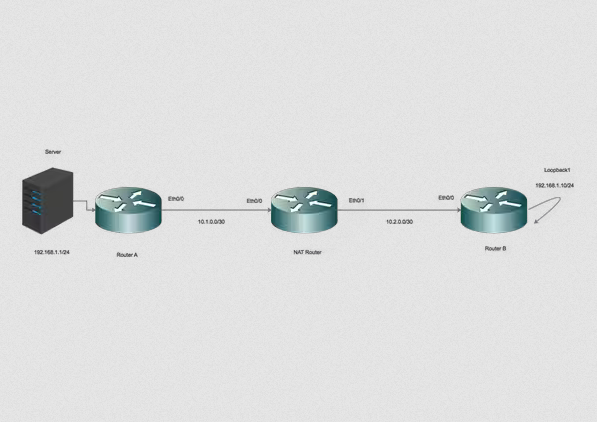

# Configure NAT to Enable Communication Between Overlapping Networks

## Introduction

This document describes how to configure Network Address Translation (NAT) to enable communication between server and client which are on different network segments with overlapping IP space.

## Prerequisites

### Requirements

There are no specific requirements for this document.

### Components Used

This document is not restricted to specific software and hardware versions.

The information in this document was created from the devices in a specific lab environment. All of the devices used in this document started with a cleared (default) configuration. If your network is live, make sure that you understand the potential impact of any command.

## Background Information

### Purpose

Enable communication between a Server and clients on two separated network segments with overlapping IP Space (usually seen when a network merger happens).

### Description

Two networks with same IP space are connected across Router A and Router B, (here we are using loopbacks to simulate the connected network).

NAT router between Router A and Router B enables the communication between overlapping IP network space.

## Configure

### Network Diagram



### Traffic Flow

- When the Clients initiate traffic to the global IP of Server, the traffic hits the NAT router and the traffic is forwarded to the Server, but when the traffic is returned back to NAT router, the Router fails to forward the traffic as the Server 192.168.1.1 is attached/known on inside interface.

- To fix this, Mask (NAT) the outside Source traffic as it traverses across the NAT router.

- Enable NAT on inside and outside interfaces.

```bash
interface Ethernet0/0
description Connection to Server
ip address 10.1.0.2 255.255.255.252
ip nat inside
end

!

interface Ethernet0/1
description Connection to Clients
ip address 10.2.0.2 255.255.255.252
ip nat outside
end

!
```

Configure NAT to translate inside local to inside Global Address.

```bash
ip nat inside source static 192.168.1.1 10.100.1.1 extendable
```

Now, configure NAT statements to translate the source of the clients as they hit the NAT outside interface.

```bash
ip nat outside source static network 192.168.1.0 10.100.2.0 /24 
```

### Routing Configuration

Route for the Server. Note that the a specific route for the server is configured pointing towards LAN ( Ethernet 0/0)

```bash
ip route 192.168.1.1 255.255.255.255 Ethernet0/0 10.1.0.1
```

Route for the Client Network:

```bash
ip route 192.168.1.0 255.255.255.0 Ethernet0/1 10.2.0.1
```

## Verify

Use this section in order to confirm that your configuration works properly.

```bash
*Aug 12 11:34:59.963: NAT*: o: icmp (192.168.1.10, 10) -> (10.100.1.1, 10) [42] 
*Aug 12 11:34:59.963: NAT*: o: icmp (192.168.1.10, 10) -> (10.100.1.1, 10) [42]
*Aug 12 11:34:59.963: NAT*: s=192.168.1.10->10.100.2.10, d=10.100.1.1 [42]
*Aug 12 11:34:59.963: NAT*: s=10.100.2.10, d=10.100.1.1->192.168.1.1 [42]
*Aug 12 11:34:59.963: NAT*: i: icmp (192.168.1.1, 10) -> (10.100.2.10, 10) [42]
*Aug 12 11:34:59.963: NAT*: s=192.168.1.1->10.100.1.1, d=10.100.2.10 [42]
*Aug 12 11:34:59.963: NAT*: s=10.100.1.1, d=10.100.2.10->192.168.1.10 [42]
NAT-Router#
*Aug 12 11:34:59.964: NAT*: o: icmp (192.168.1.10, 10) -> (10.100.1.1, 10) [43]
*Aug 12 11:34:59.964: NAT*: s=192.168.1.10->10.100.2.10, d=10.100.1.1 [43]
*Aug 12 11:34:59.964: NAT*: s=10.100.2.10, d=10.100.1.1->192.168.1.1 [43]
*Aug 12 11:34:59.964: NAT*: i: icmp (192.168.1.1, 10) -> (10.100.2.10, 10) [43]
*Aug 12 11:34:59.964: NAT*: s=192.168.1.1->10.100.1.1, d=10.100.2.10 [43]
*Aug 12 11:34:59.964: NAT*: s=10.100.1.1, d=10.100.2.10->192.168.1.10 [43]
NAT-Router#
```

As seen, when a client initiates traffic (192.168.1.10) the NAT outside translates the Outside Global to Outside Local (10.100.2.10) and then routes the traffic towards NAT inside interface.

NAT inside interface now translates the destination (10.100.1.1) to inside local address (192.168.1.1) and traffic is moved towards the server.

The server has recieved traffic with source address of 10.100.2.10.

## Troubleshoot

There is currently no specific troubleshooting information available for this configuration.

## Limitation

In this setup, only the clients can initiate a connection and the connection will be successfull.

The traffic cannot originate from inside (from Server) as the NAT will fail, since there is no NAT entry on outside local to global translation table.
